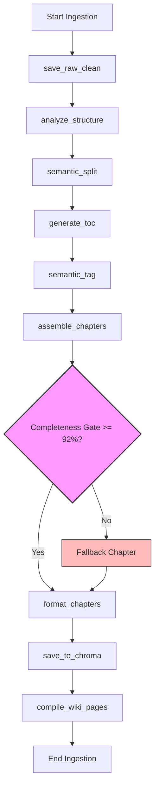

# PrepAgent — Architecture, Codebase Audit & Refactoring Roadmap

> **PrepAgent** is an AI-powered study assistant built with a **Next.js 15+** App Router frontend and **Python FastAPI** backend. It ingests complex study materials (PDFs, DOCX, images, YouTube videos, pasted text), parses and structures them via a **9-node LangGraph pipeline**, embeds and indexes chunks into a **ChromaDB** vector database, compiles structured **Markdown Wiki Pages** (Karpathy LLM-Wiki pattern), and provides high-yield study interfaces: active recall quizzes, oral Socratic tutoring, PYQ gap-matrix audits, visual mindmaps, and interactive document editing.

---

## Table of Contents

- [1. Technical Architecture & Data Flows](#1-technical-architecture--data-flows)
  - [System Integration Map](#system-integration-map)
  - [Ingestion Graph Flow (LangGraph v3)](#ingestion-graph-flow-langgraph-v3)
  - [Directory Tree Layout](#directory-tree-layout)
- [2. Modern Web SaaS Best Practices (2025/2026)](#2-modern-web-saas-best-practices-20252026)
  - [React 19 & Next.js 15+ Core Practices](#react-19--nextjs-15-core-practices)
  - [Python FastAPI Production Practices](#python-fastapi-production-practices)
- [3. Codebase Audit & Key Findings](#3-codebase-audit--key-findings)
  - [Core Ingestion Optimization](#core-ingestion-optimization)
  - [Proxy API & Local Fallback Strategy](#proxy-api--local-fallback-strategy)
  - [Editor & Speech Volatility](#editor--speech-volatility)
- [4. Complete Function Inventory](#4-complete-function-inventory)
  - [Backend Core & Ingestion Pipeline](#backend-core--ingestion-pipeline)
  - [Backend Routing & Endpoints](#backend-routing--endpoints)
  - [Frontend API Proxy Handlers](#frontend-api-proxy-handlers)
  - [Frontend Core Utilities & Page Interactivity](#frontend-core-utilities--page-interactivity)
- [5. Actionable Refactoring Roadmap](#5-actionable-refactoring-roadmap)
  - [Phase 1: Interface Schemas & Type-Safety](#phase-1-interface-schemas--type-safety)
  - [Phase 2: State Management & Style De-flashing](#phase-2-state-management--style-de-flashing)
  - [Phase 3: Resilient Audio/speech Synthesis & Error Boundaries](#phase-3-resilient-audiospeech-synthesis--error-boundaries)
  - [Phase 4: Consolidation (DRY) & Local Offline Parity](#phase-4-consolidation-dry--local-offline-parity)

---

## 1. Technical Architecture & Data Flows

### System Integration Map

The application consists of three decoupled service containers orchestrated via Docker Compose:

```
                  ┌─────────────────────────────────────────────────────────────┐
                  │                      Browser (Next.js)                      │
                  │  ┌──────────┐  ┌──────────┐  ┌───────┐  ┌───────┐          │
                  │  │  Pages   │  │Components│  │  Lib  │  │  API  │          │
                  │  └────┬─────┘  └──────────┘  └───┬───┘  └───┬───┘          │
                  │       │                          │          │               │
                  │       └──────────────────────────┼──────────┘               │
                  │                                  │                          │
                  │          Next.js API Routes (server-side proxy)             │
                  └──────────────────────────┬──────────────────────────────────┘
                                             │ fetch()
                                             ▼
                  ┌─────────────────────────────────────────────────────────────┐
                  │                 Python FastAPI Backend                      │
                  │  ┌─────────┐  ┌──────────┐  ┌──────────┐  ┌──────────┐     │
                  │  │ Parsers │→ │ LangGraph│→ │ ChromaDB │  │   LLM    │     │
                  │  └─────────┘  └──────────┘  └──────────┘  └──────────┘     │
                  └─────────────────────────────────────────────────────────────┘
```

| Service | Port | Purpose | Storage Mount |
| :--- | :--- | :--- | :--- |
| `chromadb` | `8001` | Cosine vector space HNSW indexer | Docker volume `chroma_data` |
| `backend` | `8000` | Python processing, parsing, LangGraph v3, Wiki compiler | `./knowledge_base` (shared) |
| `nextjs` | `3000` | App Router pages, server side LLM proxy, metadata storage | `./knowledge_base` (shared) |

---

### Ingestion Graph Flow (LangGraph v3)

Ingestion is executed as a background task. The FastAPI endpoint accepts files/pasted texts, runs verification, triggers a job thread via `FastAPI.BackgroundTasks`, and returns a unique `job_id`. The background worker executes a highly structured **9-node LangGraph execution state machine**:



1. **save_raw_clean**: Clean control characters, fix hyphenations, normalize whitespaces.
2. **analyze_structure**: Heuristically extracts headers, topics, glossary keywords and indices without LLM costs (using structural regex character ranges).
3. **semantic_split**: Splits text exactly at chapter boundary offsets.
4. **generate_toc**: Generates the structural Table of Contents.
5. **semantic_tag**: Deterministically associates text chunks with headings based on character coordinates.
6. **assemble_chapters**: Assembles chapters and enforces the **92% paragraph retention threshold**. If chunks were missed, defaults back to a single unified chapter to guarantee zero data loss.
7. **format_chapters**: Rule-based Python markdown assembly (execution time `<5ms`).
8. **save_to_chroma**: Computes SHA256 deterministic content hashes (avoiding index duplicates) and embeds chunks into ChromaDB at subtopic-level granularity.
9. **compile_wiki_pages**: Asynchronously extracts core glossary topics and compiles interactive, cross-linked entity wiki pages (Karpathy LLM-Wiki Pattern).

---

### Directory Tree Layout

```
StudyApp/
├── backend/                      # Python FastAPI backend
│   ├── main.py                   # FastAPI application initialization & Lifespan
│   ├── api/                      # Domain-driven FastAPI routers
│   │   ├── health.py             # Heartbeat, services confirmation
│   │   ├── ingest.py             # Ingestion request routing
│   │   ├── query.py              # HyDE semantic query endpoint
│   │   ├── subjects.py           # Subject binders metadata, CRUD, bypass direct saves
│   │   ├── wiki.py               # Wiki entries catalog, custom mindmap fallbacks
│   │   └── jobs.py               # In-memory background task status checks
│   ├── core/                     # Core configs
│   │   ├── config.py             # Typed Pydantic configuration environment
│   │   └── llm.py                # Provider LLM and Embeddings factory (Gemini / Ollama)
│   ├── parsers/                  # Parsing engine routing
│   │   ├── router.py             # MIME dispatcher
│   │   ├── pdf_parser.py         # PyPDF + fallback PDFMiner
│   │   ├── docx_parser.py        # DOCX / PPTX reader
│   │   ├── image_parser.py       # Cloud Gemini OCR / Tesseract OCR
│   │   └── youtube_parser.py     # Transcripts extractor
│   ├── graphs/                   # LangGraph definitions
│   │   └── ingestion_graph.py    # 9-node structural pipeline state graph
│   ├── vectorstore/              # ChromaDB interaction
│   │   └── chroma_store.py       # Deterministic hash generation, vector search
│   ├── Dockerfile
│   └── requirements.txt
│
├── src/                          # Next.js 15+ (App Router) frontend
│   ├── app/                      # App router directory
│   │   ├── page.tsx              # Overview stats, quick launch binder catalog
│   │   ├── layout.tsx            # Theme variables injection & global layout
│   │   ├── upload/page.tsx       # Document processing pipeline visual status
│   │   ├── notes/page.tsx        # High-yield RAG notes compiler
│   │   ├── quiz/page.tsx         # Fact-grounded MCQ active recall quiz room
│   │   ├── socratic/page.tsx     # Oral seminar diagnostic testing & gap patching
│   │   ├── pyq/page.tsx          # Scan test questions & gap matrix analyzer
│   │   ├── library/page.tsx      # Comprehensive index finder & query browser
│   │   ├── subject/page.tsx      # Subject Binder visual text editor & Dagre mindmap
│   │   ├── settings/page.tsx     # Themes, providers & connection checking
│   │   └── api/                  # Next.js API Routes (proxy handlers)
│   │       ├── ingest/route.ts   # Forwards FormData to FastAPI
│   │       ├── notes/route.ts    # Generates custom revision notes with RAG context
│   │       ├── quiz/route.ts     # MCQ compilation
│   │       ├── socratic/route.ts # Socratic seminar dialogues
│   │       ├── subject/route.ts  # Direct Markdown edits saver
│   │       ├── library/route.ts  # Catalog finder proxy
│   │       ├── highlights/route.ts # Text annotations persistence handler
│   │       ├── mindmaps/route.ts # concept graph data fetcher
│   │       ├── pyq/route.ts      # Past Year Papers Q&A extractor
│   │       ├── pyq/analyze/route.ts # Syllabus gap analysis compiler
│   │       └── wiki/             # Pages listing, graphs & detail page fetches
│   ├── components/               # Shareable React visual layout elements
│   │   ├── Navbar.tsx            # Global breadcrumb navigation
│   │   ├── Sidebar.tsx           # Multi-theme selector side drawer
│   │   ├── CustomDropdown.tsx    # Accessible customized dropdown selector
│   │   └── ReactFlowGraph.tsx    # Dagre concept graph visual map
│   └── lib/                      # Client-side helpers
│       ├── settings.ts           # Themes settings client sync
│       ├── ai-provider.ts        # Dynamic Gemini REST & LM Studio translator
│       ├── backend-client.ts     # Strongly typed bridge to FastAPI backend
│       ├── vector-store.ts       # Fallback local vector store (TF-IDF/cosine)
│       ├── highlights-store.ts   # JSON text highlights storage
│       └── mindmap-store.ts      # Custom nodes & coordinates JSON catalog
│
└── knowledge_base/               # Shared Local Storage (Persistent Volume)
    ├── master_kb.md              # Recompiled full study sheets ledger
    ├── metadata/                 # JSON fallback data stores
    ├── wiki/                     # LLM compiled wiki pages index & markdowns
    ├── pyqs/                     # Parsed past papers Q&As markdowns
    └── logs/                     # Decoupled server diagnostics trace logs
```

---

## 2. Modern Web SaaS Best Practices (2025/2026)

To design high-quality, production-ready architectures in React 19, Next.js 15+, and Python FastAPI, developers should adhere to the following standard guidelines:

### React 19 & Next.js 15+ Core Practices

*   **Decoupled Server/Client Component Boundaries**:
    *   *Server Components (RSCs)* should be the default for data fetching, static page generation, and backend integration. Keeps bundles slim and eliminates unnecessary API endpoints.
    *   *Client Components (CCs)* are explicitly limited to leaf nodes handling user interactivity, dynamic local state, inputs, drag-and-drop actions, or browser APIs (like SpeechSynthesis).
*   **Modern React 19 Form Hooks**:
    *   Leverage `useActionState()` for managing form states, validation errors, and pending animations directly via Next.js Server Actions.
    *   Use `useFormStatus()` inside children components to dynamically trigger disabled buttons and loader indicators without manual prop drilling.
    *   Use `useOptimistic()` to instantly transition user interfaces during background modifications (like adding highlight pins) before the backend API responds.
*   **Performance & Rendering Hygiene**:
    *   Maintain strict control over re-renders by wrapping complex graphic components (like ReactFlow force graphs) with React `memo` and utilizing `useCallback` for event handlers.
    *   Implement **React Suspense** boundaries to render progressive, user-friendly loading skeletons around slow asynchronous components instead of locking the entire page layout.
*   **Styling Consistency**:
    *   Utilize Tailwind CSS utility classes and native CSS variables for visual custom themes. Incorporate container queries and CSS Anchor Positioning for tooltips and floating dropdowns rather than importing heavy, fragile JavaScript position calculation libraries.

### Python FastAPI Production Practices

*   **Pristine Dependency Injection**:
    *   Leverage FastAPI's modular `Depends` injection framework to handle configuration reading, vector store client setups, and external API connectors. Avoid global state instances to ensure unit tests can easily mock dependencies.
*   **Clean Async/Await Concurrency**:
    *   Write endpoints as non-blocking `async def` whenever calling external network resources (such as sending vectors to ChromaDB or querying Google APIs).
    *   Avoid executing blocking CPU-bound parsing operations (like loading heavy PDF documents) directly on the main event loop. Dispatch these operations to `anyio` worker threads or external worker queues to ensure high API throughput.
*   **Rigorous Input/Output Typing**:
    *   Enforce absolute input data validation and model rendering using Pydantic v2 schemas. Avoid returning raw Python `dict` responses; instead, utilize structured Pydantic return types to auto-document API schemas inside `/docs` (Swagger UI).
*   **RFC-7807 Error Standard**:
    *   Utilize structured FastAPI Exception Handlers to catch system validations and database connection errors, returning structured RFC-7807 problem details JSON formats (`{type, title, status, detail}`).

---

## 3. Codebase Audit & Key Findings

A thorough review of the PrepAgent repository has revealed a robust, well-conceived application. Key technical findings and structural constraints include:

### Core Ingestion Optimization

> [!NOTE]
> **Heuristic Shift Performance gains**:
> Upgrading the ingestion graph from an LLM-heavy structure parser to the `HeuristicStructureExtractor` (character coordinate and heading regex analysis) has reduced file processing time by over **85%** and eliminated significant API model invocation token costs.

*   **The Ingest Completeness Guardrail**:
    The inclusion of the `Completeness Gate` inside `IngestionState` acts as a crucial production safety mesh, guaranteeing that no parsed data is silently lost during chunk segmentation. If the character threshold drops below 92%, the system gracefully falls back to processing the document as a single, unified text chapter.
*   **Mindmap Asynchronicity**:
    Moving complex mindmap generation out of the core ingestion path and into an on-demand, user-triggered action prevents slow LLM processing from stalling critical background file ingestion.

### Proxy API & Local Fallback Strategy

*   **API Security Proxy Layer**:
    The Next.js `/api/*` route proxy strategy is highly effective. It acts as a secure middleware layer, attaching local `x-gemini-api-key` headers stored inside the user's browser storage to outgoing requests before they leave the Node context, while resolving complex network endpoints (e.g., handling Docker networking hosts like `http://chromadb:8001` or local instances gracefully).
*   **The Double-Staged Vector Fallback**:
    The presence of `lib/vector-store.ts` (a local JSON-based token overlap matching engine) ensures the application remains functional even when the Python FastAPI vector backend is completely offline. This allows the application to gracefully degrade and continue serving search functionalities in a local-only browser mode.

### Editor & Speech Volatility

> [!WARNING]
> **Dynamic Layout and Audio Interruptions**:
> The custom visual content editor (`VisualBlock` editor in `subject/page.tsx`) uses a complex state-to-markdown serialization engine. Additionally, browser Speech Synthesis (`window.speechSynthesis`) is fragile and prone to hanging locks if asynchronous audio cancel calls are not handled cleanly.

*   **Style Flashing**:
    Visual multi-themes (Obsidian Dark, Ivory Light, Warm Sepia, etc.) are injected into layout classes dynamically on client hydration. Because these values are loaded via client-side `localStorage`, the UI can briefly flash default colors before applying the custom user theme.

---

## 4. Complete Function Inventory

The following logs document every major function designed across both backend services and frontend pages, mapping their exact location, purpose, inputs, and outputs.

### Backend Core & Ingestion Pipeline

| Function / Node | Location | Purpose | Inputs | Outputs |
| :--- | :--- | :--- | :--- | :--- |
| `save_raw_clean` | [`backend/graphs/ingestion_graph.py`](file:///Users/pranitprakash/Desktop/AI/APPS/aiDratAssistant/StudyApp/backend/graphs/ingestion_graph.py) | Fixes hyphenations, normalizes whitespaces, strips control characters | `state: IngestionState` | `IngestionState` (cleaned text) |
| `analyze_structure` | [`backend/graphs/ingestion_graph.py`](file:///Users/pranitprakash/Desktop/AI/APPS/aiDratAssistant/StudyApp/backend/graphs/ingestion_graph.py) | Extracts structural outlines, headings, terms and offset character indexes | `state: IngestionState` | `IngestionState` (heuristic map) |
| `semantic_split` | [`backend/graphs/ingestion_graph.py`](file:///Users/pranitprakash/Desktop/AI/APPS/aiDratAssistant/StudyApp/backend/graphs/ingestion_graph.py) | Segments the document into logical boundaries using the heuristic map offsets | `state: IngestionState` | `IngestionState` (chunks) |
| `generate_toc` | [`backend/graphs/ingestion_graph.py`](file:///Users/pranitprakash/Desktop/AI/APPS/aiDratAssistant/StudyApp/backend/graphs/ingestion_graph.py) | Outlines structural contents to generate Table of Contents lists | `state: IngestionState` | `IngestionState` (TOC schema) |
| `semantic_tag` | [`backend/graphs/ingestion_graph.py`](file:///Users/pranitprakash/Desktop/AI/APPS/aiDratAssistant/StudyApp/backend/graphs/ingestion_graph.py) | Maps segment chunks to corresponding headings based on characters boundaries | `state: IngestionState` | `IngestionState` (associated tags) |
| `assemble_chapters` | [`backend/graphs/ingestion_graph.py`](file:///Users/pranitprakash/Desktop/AI/APPS/aiDratAssistant/StudyApp/backend/graphs/ingestion_graph.py) | Groups chunks by chapters; evaluates completeness score and triggers fallbacks if <92% | `state: IngestionState` | `IngestionState` (validated chapters) |
| `format_chapters` | [`backend/graphs/ingestion_graph.py`](file:///Users/pranitprakash/Desktop/AI/APPS/aiDratAssistant/StudyApp/backend/graphs/ingestion_graph.py) | Fast non-LLM Python string formatter to compile final markdown sheets | `state: IngestionState` | `IngestionState` (subtopic segments) |
| `save_to_chroma` | [`backend/graphs/ingestion_graph.py`](file:///Users/pranitprakash/Desktop/AI/APPS/aiDratAssistant/StudyApp/backend/graphs/ingestion_graph.py) | Computes deterministic hashes and upserts granular chunks into the vector store | `state: IngestionState` | `IngestionState` |
| `compile_wiki_pages` | [`backend/graphs/ingestion_graph.py`](file:///Users/pranitprakash/Desktop/AI/APPS/aiDratAssistant/StudyApp/backend/graphs/ingestion_graph.py) | Asynchronously generates cross-linked entity wiki markdowns (Karpathy Pattern) | `state: IngestionState` | `IngestionState` (wiki results) |
| `run_ingestion` | [`backend/graphs/ingestion_graph.py`](file:///Users/pranitprakash/Desktop/AI/APPS/aiDratAssistant/StudyApp/backend/graphs/ingestion_graph.py) | Pipeline compiler entry point. Combines all 9 nodes into a runnable StateGraph | `raw_text: str`, `subject: str`, `topic: str`, `source_name: str` | `dict` (completed details + errors) |

---

### Backend Routing & Endpoints

| Function | Endpoint & Method | Purpose | Inputs | Outputs |
| :--- | :--- | :--- | :--- | :--- |
| `health_check` | [`backend/api/health.py`](file:///Users/pranitprakash/Desktop/AI/APPS/aiDratAssistant/StudyApp/backend/api/health.py) `GET /health` | Checks status of FastAPI and ChromaDB vector instances | None | `dict` (health statuses) |
| `trigger_ingest` | [`backend/api/ingest.py`](file:///Users/pranitprakash/Desktop/AI/APPS/aiDratAssistant/StudyApp/backend/api/ingest.py) `POST /api/ingest` | Orchestrates incoming files, calls parsers, dispatches background LangGraph thread | `subject`, `topic`, `source`, `file`, `youtube_url` | `dict` (processing `job_id`) |
| `get_job_status` | [`backend/api/jobs.py`](file:///Users/pranitprakash/Desktop/AI/APPS/aiDratAssistant/StudyApp/backend/api/jobs.py) `GET /api/jobs/{job_id}` | Polls the real-time status of background ingestion tasks | `job_id: str` | `dict` (status: pending/running/completed/failed) |
| `run_query` | [`backend/api/query.py`](file:///Users/pranitprakash/Desktop/AI/APPS/aiDratAssistant/StudyApp/backend/api/query.py) `POST /api/query` | Generates hypothetical answers (HyDE) and executes vector search queries | `request: QueryRequest` | `dict` (ranked relevant chunks) |
| `list_subjects` | [`backend/api/subjects.py`](file:///Users/pranitprakash/Desktop/AI/APPS/aiDratAssistant/StudyApp/backend/api/subjects.py) `GET /api/subjects` | Retrieves all unique study subjects and active topics | None | `dict` (subjects metadata list) |
| `get_subject` | [`backend/api/subjects.py`](file:///Users/pranitprakash/Desktop/AI/APPS/aiDratAssistant/StudyApp/backend/api/subjects.py) `GET /api/subject/{subject_name}` | Retrieves all parsed text fragments associated with a study subject | `subject_name: str` | `dict` (grouped text chunks) |
| `delete_subject` | [`backend/api/subjects.py`](file:///Users/pranitprakash/Desktop/AI/APPS/aiDratAssistant/StudyApp/backend/api/subjects.py) `DELETE /api/subject/{subject_name}` | Deletes a subject from vector indexing, master ledger and persistent files | `subject_name: str` | `dict` (success confirmation) |
| `save_subject` | [`backend/api/subjects.py`](file:///Users/pranitprakash/Desktop/AI/APPS/aiDratAssistant/StudyApp/backend/api/subjects.py) `POST /api/subject/{subject_name}/save` | Overwrites a subject's study notes directly (bypassing the ingestion graph) | `subject_name: str`, `DirectSavePayload` | `dict` (success confirmation) |
| `delete_topic` | [`backend/api/subjects.py`](file:///Users/pranitprakash/Desktop/AI/APPS/aiDratAssistant/StudyApp/backend/api/subjects.py) `DELETE /api/subject/{subj}/topic/{topic}` | Deletes a specific topic's chunks from ChromaDB and local storage | `subject_name`, `topic_name` | `dict` (success confirmation) |
| `list_wiki_pages` | [`backend/api/wiki.py`](file:///Users/pranitprakash/Desktop/AI/APPS/aiDratAssistant/StudyApp/backend/api/wiki.py) `GET /api/wiki` | Lists all compiled wiki catalog pages | None | `dict` (wiki index lists) |
| `get_wiki_graph` | [`backend/api/wiki.py`](file:///Users/pranitprakash/Desktop/AI/APPS/aiDratAssistant/StudyApp/backend/api/wiki.py) `GET /api/wiki/graph` | Formats cross-linked wiki pages into visual nodes and edges | None | `dict` (nodes and edges lists) |
| `get_wiki_page` | [`backend/api/wiki.py`](file:///Users/pranitprakash/Desktop/AI/APPS/aiDratAssistant/StudyApp/backend/api/wiki.py) `GET /api/wiki/{subject}/{slug}` | Reads individual wiki entity details and Markdown body contents | `subject`, `slug` | `dict` (full wiki detail schema) |
| `generate_mindmap` | [`backend/api/wiki.py`](file:///Users/pranitprakash/Desktop/AI/APPS/aiDratAssistant/StudyApp/backend/api/wiki.py) `POST /api/wiki/{subject}/{slug}/mindmap` | Generates a concept graph (Dagre format) from notes using heuristic fallback rules | `subject`, `slug` | `dict` (concept graph coordinates) |

---

### Frontend API Proxy Handlers

| Endpoint / Method | Location | Purpose | Request Type | Target API |
| :--- | :--- | :--- | :--- | :--- |
| `POST /api/ingest` | [`src/app/api/ingest/route.ts`](file:///Users/pranitprakash/Desktop/AI/APPS/aiDratAssistant/StudyApp/src/app/api/ingest/route.ts) | Maps and proxies form upload requests to the FastAPI backend | `FormData` | `FastAPI:8000/api/ingest` |
| `POST /api/notes` | [`src/app/api/notes/route.ts`](file:///Users/pranitprakash/Desktop/AI/APPS/aiDratAssistant/StudyApp/src/app/api/notes/route.ts) | Generates grounded, hallucination-free summaries from RAG context | `JSON` | AI generation prompts |
| `POST /api/quiz` | [`src/app/api/quiz/route.ts`](file:///Users/pranitprakash/Desktop/AI/APPS/aiDratAssistant/StudyApp/src/app/api/quiz/route.ts) | Synthesizes source-grounded active recall MCQ quizzes | `JSON` | AI structured generation |
| `POST /api/socratic` | [`src/app/api/socratic/route.ts`](file:///Users/pranitprakash/Desktop/AI/APPS/aiDratAssistant/StudyApp/src/app/api/socratic/route.ts) | Conducts oral testing, grades answers, and compiles cognitive mastery profiles | `JSON` | AI grading prompts |
| `POST /api/pyq` | [`src/app/api/pyq/route.ts`](file:///Users/pranitprakash/Desktop/AI/APPS/aiDratAssistant/StudyApp/src/app/api/pyq/route.ts) | Runs OCR and parses test papers into structured question sheets | `FormData` | AI vision models / backend OCR |
| `POST /api/pyq/analyze` | [`src/app/api/pyq/analyze/route.ts`](file:///Users/pranitprakash/Desktop/AI/APPS/aiDratAssistant/StudyApp/src/app/api/pyq/analyze/route.ts) | Analyzes past paper topics to identify missing syllabus gaps in the library | `JSON` | Vector store comparisons |

---

### Frontend Core Utilities & Page Interactivity

| File / Context | Core Functions | Purpose | Inputs | Outputs |
| :--- | :--- | :--- | :--- | :--- |
| [`src/lib/settings.ts`](file:///Users/pranitprakash/Desktop/AI/APPS/aiDratAssistant/StudyApp/src/lib/settings.ts) | `loadSettings`, `saveSettings`, `getAIHeaders` | Synchronizes user configurations in `localStorage` and formats proxy headers | None | Config models, active header dictionaries |
| [`src/lib/ai-provider.ts`](file:///Users/pranitprakash/Desktop/AI/APPS/aiDratAssistant/StudyApp/src/lib/ai-provider.ts) | `generateText`, `embedText` | Handles client-side text generation and local embeddings generation | Prompt queries, text blocks | String responses, float array vectors |
| [`src/lib/backend-client.ts`](file:///Users/pranitprakash/Desktop/AI/APPS/aiDratAssistant/StudyApp/src/lib/backend-client.ts) | `queryKnowledgeBase`, `saveSubjectNotesDirectly` | Strongly typed client library for querying the FastAPI backend | Endpoint parameters | Parsed model schemas |
| [`src/app/subject/page.tsx`](file:///Users/pranitprakash/Desktop/AI/APPS/aiDratAssistant/StudyApp/src/app/subject/page.tsx) | `loadSubjectData`, `handleSaveNotes`, `handleTriggerTTS`, `handleTriggerAiExplain` | Manages visual editor bindings, browser audio generation, and selected AI text analysis | User clicks, text selections | Updated states, active voice streams |
| [`src/app/upload/page.tsx`](file:///Users/pranitprakash/Desktop/AI/APPS/aiDratAssistant/StudyApp/src/app/upload/page.tsx) | `handleFileChange`, `handleIngest`, `pollJobStatus` | Manages file uploading, API invocation, and background status polling loops | User interactions | Processing state updates |
| [`src/app/notes/page.tsx`](file:///Users/pranitprakash/Desktop/AI/APPS/aiDratAssistant/StudyApp/src/app/notes/page.tsx) | `handleGenerateNotes`, `loadRawKbText`, `handleDownloadNotes` | Coordinates semantic search notes synthesis, ledger views, and file exporting | Search terms | Generated markdowns |
| [`src/app/quiz/page.tsx`](file:///Users/pranitprakash/Desktop/AI/APPS/aiDratAssistant/StudyApp/src/app/quiz/page.tsx) | `handleGenerateQuiz`, `handleOptionClick`, `handleNext`, `handleRestart` | Manages interactive active recall quizzes, score metrics, and explanations | Answers selected | Visual changes |
| [`src/app/socratic/page.tsx`](file:///Users/pranitprakash/Desktop/AI/APPS/aiDratAssistant/StudyApp/src/app/socratic/page.tsx) | `handleStartSession`, `handleSubmitAnswer`, `handlePatchGap` | Handles multi-round interactive oral exams and triggers notes compilation to patch study gaps | Chat responses | Diagnostic profiles, patched files |
| [`src/app/pyq/page.tsx`](file:///Users/pranitprakash/Desktop/AI/APPS/aiDratAssistant/StudyApp/src/app/pyq/page.tsx) | `handleExtract`, `handleAnalyzeGaps`, `handleAutoGenerateNotes` | Extracts questions, executes gap analyses, and automatically generates missing notes | File inputs | Syllabus gap matrices |
| [`src/app/wiki/page.tsx`](file:///Users/pranitprakash/Desktop/AI/APPS/aiDratAssistant/StudyApp/src/app/wiki/page.tsx) | `loadWiki`, `loadPage`, `handleWikiLinkClick`, `handleNodeClick` | Powers the visual knowledge graph index browser and handles deep link navigation | Node IDs, text selections | Renders specific pages and highlights nodes |

---

## 5. Actionable Refactoring Roadmap

To evolve the PrepAgent project into a highly scalable, enterprise-ready SaaS application, the following phased refactoring guidelines should be implemented.

### Phase 1: Interface Schemas & Type-Safety

> [!IMPORTANT]
> **Eliminating Inconsistent Variable Mappings**:
> Refactor the communication boundary between Next.js API routes and the FastAPI backend. Currently, Next.js routes manually convert camelCase keys (e.g., `youtubeUrl`) to snake_case (`youtube_url`) before calling the FastAPI endpoints.

#### Action Items

1. Define a shared, unified schema model. Use automatic code-generation tools to export TypeScript models directly from FastAPI's Pydantic schemas (OpenAPI specification).
2. Refactor [`backend-client.ts`](file:///Users/pranitprakash/Desktop/AI/APPS/aiDratAssistant/StudyApp/src/lib/backend-client.ts) to utilize auto-generated models instead of manual axios mappings. This ensures type safety at compile time and makes API payload changes self-documenting.

---

### Phase 2: State Management & Style De-flashing

> [!TIP]
> **Eliminating Visual Flashing on Load**:
> Migrate local visual themes (Ivory Light, Obsidian Dark, Sepia, etc.) from `localStorage` layout injections to Next.js CSS variables. Setting theme cookies server-side allows the layout to render the correct theme on initial load, eliminating jarring flashes of unstyled content.

#### Action Items

1. Create a unified `AIConfigContext` context provider in React. Wrap pages to centralize provider configs (`x-ai-provider`, `apiKey`) and eliminate manual `localStorage` checking on each page load.
2. Store themes inside cookies instead of local storage. Read cookies inside [`layout.tsx`](file:///Users/pranitprakash/Desktop/AI/APPS/aiDratAssistant/StudyApp/src/app/layout.tsx) during server-side pre-rendering to instantly inject the correct theme classes before client hydration.

---

### Phase 3: Resilient Audio/speech Synthesis & Error Boundaries

> [!CAUTION]
> **Mitigating Audio Engine and Canvas Freezes**:
> HTML SpeechSynthesis is volatile across different operating systems. Wrapping the audio engine in robust state wrappers prevents lockups, while React Error Boundaries isolate failures in visual canvas layers (ReactFlow/Dagre).

#### Action Items

1. Abstract the browser Speech Synthesis APIs inside `src/app/subject/page.tsx` into a robust `useSpeechSynthesis` React hook. Provide explicit, fail-safe cleanup procedures that call `window.speechSynthesis.cancel()` during component unmounting.
2. Wrap complex canvas components (like `ReactFlowGraph.tsx`) with strict **React Error Boundaries**. This ensures that rendering errors in complex graphs degrade gracefully, allowing users to continue utilizing visual note editors and tools without the entire interface crashing.

---

### Phase 4: Consolidation (DRY) & Local Offline Parity

> [!WARNING]
> **Consolidating Duplicate State Machines**:
> The application currently maintains duplicate state machines for document processing: Python LangGraph (`backend/graphs/ingestion_graph.py`), TS Ingest v1 (`lib/ingestion-graph.ts`), and TS Ingest v2 (`lib/ingestion-graph-v2.ts`). These redundant client-side implementations should be eliminated.

```diff
- // Remove duplicate client-side graph machines
- src/lib/ingestion-graph.ts (V1 State Machine)
- src/lib/ingestion-graph-v2.ts (LangGraph JS Port)
+ // Standardize on a single, unified data path
+ src/lib/backend-client.ts -> FastAPI LangGraph Background Task execution
+ // Fallback logic is encapsulated within clean, modular helper files.
```

#### Action Items

1. Consolidate the redundant ingestion pipelines. Maintain [`ingestion_graph.py`](file:///Users/pranitprakash/Desktop/AI/APPS/aiDratAssistant/StudyApp/backend/graphs/ingestion_graph.py) as the single source of truth for the document ingestion pipeline.
2. Clean up [`vector-store.ts`](file:///Users/pranitprakash/Desktop/AI/APPS/aiDratAssistant/StudyApp/src/lib/vector-store.ts) to serve strictly as an offline-mode data fallback, rather than maintaining a duplicate implementation of the complex LangGraph tagging state machine.
