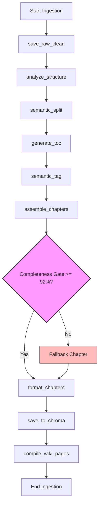

# PrepAgent — Architecture, Codebase Audit & Refactoring Roadmap

> **PrepAgent** is an AI-powered study assistant built with a **Next.js 16** App Router frontend and **Python FastAPI** backend. It ingests complex study materials (PDFs, DOCX, images, YouTube videos, pasted text), parses and structures them via a **9-node LangGraph pipeline**, embeds and indexes chunks into a **ChromaDB** vector database, compiles structured **Markdown Wiki Pages** (Karpathy LLM-Wiki pattern), and provides high-yield study interfaces: active recall quizzes, oral Socratic tutoring, PYQ gap-matrix audits, visual mindmaps, interactive document editing, and AI-curated current affairs digests.

---

## Table of Contents

- [1. Technical Architecture & Data Flows](#1-technical-architecture--data-flows)
  - [System Integration Map](#system-integration-map)
  - [Ingestion Graph Flow (LangGraph v3)](#ingestion-graph-flow-langgraph-v3)
  - [Directory Tree Layout](#directory-tree-layout)
- [2. Recent Changes & New Features](#2-recent-changes--new-features)
  - [Current Affairs Module](#current-affairs-module)
  - [Backend Resilience & Thread Safety](#backend-resilience--thread-safety)
  - [Multi-Provider AI Support](#multi-provider-ai-support)
  - [Subject Page Enhancements](#subject-page-enhancements)
  - [Library Page Redesign](#library-page-redesign)
- [3. Known Issues & Technical Debt](#3-known-issues--technical-debt)
  - [CSS Custom Property Fragility](#css-custom-property-fragility)
  - [Backend Client Header Forwarding](#backend-client-header-forwarding)
  - [Streaming SSE Code Duplication](#streaming-sse-code-duplication)
  - [Subject Page Monolith](#subject-page-monolith)
  - [In-Memory Task Tracker](#in-memory-task-tracker)
  - [No Test Coverage](#no-test-coverage)
- [4. Complete Function Inventory](#4-complete-function-inventory)
  - [Backend Core & Ingestion Pipeline](#backend-core--ingestion-pipeline)
  - [Backend Routing & Endpoints](#backend-routing--endpoints)
  - [Frontend API Proxy Handlers](#frontend-api-proxy-handlers)
  - [Frontend Core Utilities & Page Interactivity](#frontend-core-utilities--page-interactivity)
- [5. Actionable Refactoring Roadmap](#5-actionable-refactoring-roadmap)
  - [Phase 1: Interface Schemas & Type-Safety](#phase-1-interface-schemas--type-safety)
  - [Phase 2: State Management & Style De-flashing](#phase-2-state-management--style-de-flashing)
  - [Phase 3: Resilient Audio/speech Synthesis & Error Boundaries](#phase-3-resilient-audiospeech-synthesis--error-boundaries)
  - [Phase 4: Consolidation (DRY) & Local Offline Parity](#phase-4-consolidation-dry--local-offline-parity)
  - [Phase 5: Documentation Automation & Code Quality](#phase-5-documentation-automation--code-quality)

---

## 1. Technical Architecture & Data Flows

### System Integration Map

The application consists of three decoupled service containers orchestrated via Docker Compose, plus a growing set of direct Node.js API routes that interface with AI providers without proxying through the backend:

```
                  ┌─────────────────────────────────────────────────────────────────────┐
                  │                      Browser (Next.js 16)                           │
                  │  ┌──────────┐  ┌──────────┐  ┌───────┐  ┌──────────────┐           │
                  │  │  Pages   │  │Components│  │  Lib  │  │  API Routes  │           │
                  │  └────┬─────┘  └──────────┘  └───┬───┘  └──────┬───────┘           │
                  │       │                          │             │                    │
                  │       └──────────────────────────┼─────────────┘                    │
                  │                                  │              │                   │
                  │          Proxy routes ───────────┼──────────────┤  Direct AI routes │
                  │          (ingest, subject,        │              │  (current-affairs,│
                  │           library, wiki, tasks,   │              │   notes*, quiz,   │
                  │           jobs, mindmap, reset)   │              │   socratic,       │
                  │                                  │              │   restructure,    │
                  │                                  ▼              │   fix-links,      │
                  │                        ┌──────────────────┐     │   explain,        │
                  │                        │  Python FastAPI  │     │   upload, pyq)    │
                  │                        │    Backend       │     └────────┬──────────┘
                  │                        │  ┌──────────┐    │              │
                  │                        │  │ LangGraph │    │              │  direct fetch()
                  │                        │  │ Pipeline  │    │              ▼
                  │                        │  └────┬─────┘    │     ┌──────────────────┐
                  │                        │       │           │     │  AI Providers     │
                  │                        │  ┌────▼─────┐    │     │  (Gemini, OpenAI, │
                  │                        │  │ ChromaDB │    │     │   Groq, OpenRouter,│
                  │                        │  │ (vector) │    │     │   Mistral, Deep-  │
                  │                        │  └──────────┘    │     │   Seek, LM Studio)│
                  │                        └──────────────────┘     └──────────────────┘
```

| Service | Port | Purpose | Storage Mount |
| :--- | :--- | :--- | :--- |
| `chromadb` | `8001` | Cosine vector space HNSW indexer | Docker volume `chroma_data` |
| `backend` | `8000` | Python processing, parsing, LangGraph v3, Wiki compiler | `./knowledge_base` (shared) |
| `nextjs` | `3000` | App Router pages, server side LLM proxy, metadata storage | `./knowledge_base` (shared) |
| `caddy` | `80/443` | Reverse proxy for production deployment | Docker volumes |

**Data flow for AI-dependent features:**

1. **Proxy pattern (ingestion, subjects, library search, wiki):** Next.js API route → `fetch()` → FastAPI backend → ChromaDB/LLM
2. **Direct AI pattern (current affairs, quiz, socratic, notes, restructure, fix-links):** Next.js API route → direct `fetch()` to AI provider (Gemini REST API or OpenAI-compatible endpoint) — bypasses FastAPI entirely
3. **File upload (images):** Next.js API route `/api/upload` → saves to `public/uploads/` directly without backend involvement

---

### Ingestion Graph Flow (LangGraph v3)

Ingestion is executed as a background task. The FastAPI endpoint accepts files/pasted texts, runs verification, queues as a pending entry, then the `/api/process/{subject}` endpoint triggers a full **9-node LangGraph execution state machine**:



1. **save_raw_clean**: Clean control characters, fix hyphenations, normalize whitespaces.
2. **analyze_structure**: Heuristically extracts headers, topics, glossary keywords and indices without LLM costs (using structural regex character ranges).
3. **semantic_split**: Splits text exactly at chapter boundary offsets.
4. **generate_toc**: Generates the structural Table of Contents.
5. **semantic_tag**: Deterministically associates text chunks with headings based on character coordinates.
6. **assemble_chapters**: Assembles chapters and enforces the **92% paragraph retention threshold**. If chunks were missed, defaults back to a single unified chapter to guarantee zero data loss.
7. **format_chapters**: Rule-based Python markdown assembly (execution time `<5ms`).
8. **save_to_chroma**: Computes SHA256 deterministic content hashes (avoiding index duplicates) and embeds chunks into ChromaDB at subtopic-level granularity. Also syncs to local markdown binder file.
9. **compile_wiki_pages**: Asynchronously extracts core glossary topics and compiles interactive, cross-linked entity wiki pages (Karpathy LLM-Wiki Pattern).

---

### Directory Tree Layout

```
StudyApp/
├── backend/                          # Python FastAPI backend
│   ├── main.py                       # FastAPI app init, lifespan, CORS, middleware, routers
│   ├── Dockerfile
│   ├── requirements.txt
│   ├── api/                          # Domain-driven FastAPI routers
│   │   ├── __init__.py
│   │   ├── health.py                 # Heartbeat, services confirmation
│   │   ├── ingest.py                 # Ingestion request routing (parse → mark_pending)
│   │   ├── query.py                  # HyDE semantic query endpoint
│   │   ├── subjects.py               # Subject binders CRUD, direct save bypassing ingestion
│   │   ├── wiki.py                   # Wiki entries catalog, mindmap generation
│   │   ├── pending.py                # Async pending queue management (JSON file-backed)
│   │   ├── pending_check.py          # GET endpoints for pending status checks
│   │   ├── process.py                # POST trigger for background LangGraph pipeline
│   │   ├── task_tracker.py           # In-memory async task tracking (create/update/cancel)
│   │   ├── tasks_router.py           # REST endpoints for task status polling
│   │   ├── current_affairs.py        # Save current affairs digests to ChromaDB + binder
│   │   └── reset.py                  # Full system reset (ChromaDB + files)
│   ├── core/                         # Core configs
│   │   ├── __init__.py
│   │   ├── config.py                 # Typed Pydantic-settings (env vars / .env)
│   │   ├── context.py                # ContextVars for request-scoped AI credentials
│   │   └── llm.py                    # LLM + Embeddings factory (7 providers)
│   ├── parsers/                      # Parsing engine routing
│   │   ├── __init__.py
│   │   ├── router.py                 # MIME dispatcher
│   │   ├── pdf_parser.py             # PyPDF + fallback PDFMiner
│   │   ├── docx_parser.py            # DOCX / PPTX reader
│   │   ├── image_parser.py           # Cloud Gemini OCR / Tesseract OCR
│   │   ├── youtube_parser.py         # Transcripts extractor
│   │   └── structure_extractor.py    # HeuristicStructureExtractor (zero-LLM)
│   ├── graphs/                       # LangGraph definitions
│   │   ├── __init__.py
│   │   └── ingestion_graph.py        # 9-node structural pipeline (ContextVar callbacks)
│   ├── vectorstore/                  # ChromaDB interaction
│   │   ├── __init__.py
│   │   └── chroma_store.py           # Embedders (Gemini/OpenAI/Ollama/Fallback), upsert, query, HyDE
│   └── wiki/                         # Wiki compiler
│       ├── __init__.py
│       └── wiki_compiler.py          # Async LLM wiki compilation (asyncio.Lock protected)
│
├── src/                              # Next.js 16 App Router frontend
│   ├── app/                          # App router directory
│   │   ├── globals.css               # Tailwind v4 + CSS custom properties (5 themes)
│   │   ├── layout.tsx                # Theme injection script, AIConfigProvider
│   │   ├── instrumentation.ts        # Next.js instrumentation (logger init)
│   │   ├── page.tsx                  # Dashboard (stats, quick-launch catalog)
│   │   ├── current-affairs/
│   │   │   └── page.tsx              # AI-curated news digest with streaming + history
│   │   ├── library/
│   │   │   └── page.tsx              # Study library catalog + search
│   │   ├── notes/
│   │   │   └── page.tsx              # RAG notes compiler
│   │   ├── quiz/
│   │   │   └── page.tsx              # MCQ active recall quiz room
│   │   ├── socratic/
│   │   │   └── page.tsx              # Oral seminar diagnostic tutoring
│   │   ├── pyq/
│   │   │   └── page.tsx              # PYQ extraction & gap analysis
│   │   ├── subject/
│   │   │   └── page.tsx              # Subject Binder editor (visual + markdown + mindmap)
│   │   ├── upload/
│   │   │   └── page.tsx              # Document upload & ingestion pipeline
│   │   ├── wiki/
│   │   │   └── page.tsx              # Wiki knowledge graph explorer
│   │   ├── settings/
│   │   │   ├── page.tsx              # AI provider config, themes
│   │   │   └── diagnostics/
│   │   │       └── page.tsx          # Server log viewer
│   │   └── api/                      # Next.js API Routes (30 handlers)
│   │       ├── admin/logs/route.ts
│   │       ├── current-affairs/
│   │       │   ├── route.ts          # SSE streaming digest generation
│   │       │   ├── history/route.ts  # Historical digest retrieval
│   │       │   ├── image/route.ts    # Unsplash image enrichment
│   │       │   └── save/route.ts     # Save digest to backend
│   │       ├── highlights/route.ts
│   │       ├── ingest/route.ts
│   │       ├── jobs/[jobId]/route.ts
│   │       ├── library/route.ts
│   │       ├── mindmaps/
│   │       │   ├── route.ts
│   │       │   └── generate/route.ts
│   │       ├── notes/
│   │       │   ├── route.ts
│   │       │   ├── explain/route.ts
│   │       │   ├── fix-links/route.ts
│   │       │   ├── restructure/route.ts
│   │       │   └── restructure/stream/route.ts
│   │       ├── pyq/
│   │       │   ├── route.ts
│   │       │   └── analyze/route.ts
│   │       ├── quiz/route.ts
│   │       ├── reset/route.ts
│   │       ├── settings/test/route.ts
│   │       ├── socratic/route.ts
│   │       ├── subject/route.ts
│   │       ├── tasks/
│   │       │   ├── route.ts
│   │       │   ├── [taskId]/route.ts
│   │       │   └── [taskId]/cancel/route.ts
│   │       ├── upload/route.ts
│   │       └── wiki/
│   │           ├── route.ts
│   │           ├── graph/route.ts
│   │           └── [subject]/[slug]/route.ts
│   ├── components/                   # Shareable React components
│   │   ├── Card.tsx
│   │   ├── CustomDropdown.tsx
│   │   ├── EmptyState.tsx
│   │   ├── ErrorAlert.tsx
│   │   ├── GraphErrorBoundary.tsx    # Class-based error boundary for ReactFlow
│   │   ├── LoadingState.tsx
│   │   ├── Navbar.tsx                # Breadcrumbs, search, task counter
│   │   ├── PageHeader.tsx
│   │   ├── PageLayout.tsx            # Sidebar + Navbar + content wrapper
│   │   ├── ProcessingDashboard.tsx   # Background task progress modal
│   │   ├── ReactFlowGraph.tsx        # Dagre-based knowledge graph visualization
│   │   ├── Sidebar.tsx               # 10-item navigation + theme switcher
│   │   ├── StatusBadge.tsx
│   │   └── TabGroup.tsx
│   ├── contexts/
│   │   └── AIConfigContext.tsx       # Settings provider with hydration-safe loading
│   ├── hooks/
│   │   └── useSpeechSynthesis.ts     # Block-by-block TTS with voice selection
│   └── lib/                          # Client-side helpers
│       ├── ai-provider.ts            # Multi-provider AI client (7 providers)
│       ├── backend-client.ts         # Typed bridge to FastAPI (with header forwarding)
│       ├── settings.ts               # localStorage settings + theme system
│       ├── utils.ts                  # formatDisplayName
│       ├── vector-store.ts           # Local JSON-based fallback vector search
│       ├── highlights-store.ts       # JSON-based highlight persistence
│       ├── logger.ts                 # Server-side console interceptor
│       └── mindmap-store.ts          # JSON-based mindmap persistence
│
├── knowledge_base/                   # Shared Local Storage (Persistent Volume)
│   ├── binders/                      # Per-subject markdown files (single source of truth)
│   ├── master_kb.md                  # Recompiled full study sheets ledger
│   ├── metadata/                     # JSON fallback data stores
│   │   ├── pending_processing.json   # Deferred ingestion queue
│   │   ├── vector_db.json            # Local vector DB fallback
│   │   ├── highlights.json           # Text annotations
│   │   └── mindmaps.json             # Saved mindmap graphs
│   ├── wiki/                         # LLM compiled wiki pages index + markdowns
│   ├── pyqs/                         # Parsed past papers Q&As markdowns
│   └── logs/                         # Server diagnostics trace logs
│       ├── backend.log               # Rotating FastAPI log (10MB, 2 backups)
│       └── nextjs.log                # Intercepted console output
│
├── public/
│   └── uploads/                      # User-uploaded images (via /api/upload)
│
├── scripts/                          # Utility scripts
│   └── docgen.py                     # Automated codebase documentation generator
│
├── .env                              # Environment variables (API keys, config)
├── docker-compose.yml                # 4-service orchestration
├── Dockerfile.nextjs                 # Next.js production build
├── start.sh                          # Full-stack launcher (ChromaDB → Backend → Next.js)
├── Caddyfile                         # Production reverse proxy config
└── DOCUMENTATION.md                  # This file
```

---

## 2. Recent Changes & New Features

### Current Affairs Module

A complete full-stack feature for AI-curated current affairs news digest generation.

**Backend (`backend/api/current_affairs.py`):**
- `POST /api/current-affairs/save` — Persists news items as ChromaDB chunks under "Current Affairs" subject AND appends to `knowledge_base/binders/Current Affairs.md`
- Each item is stored with `headline`, `summary`, `examRelevance`, `source`, `category`, and optional `imageUrl`
- Automatically creates daily date-based sections in the binder file

**Frontend API routes:**
- `POST /api/current-affairs` — SSE streaming endpoint that generates a curated digest via any configured AI provider (300 lines, multi-provider branching)
- `POST /api/current-affairs/save` — Thin proxy to backend save endpoint
- `GET/POST /api/current-affairs/history` — Lists past digests, loads specific date content
- `GET /api/current-affairs/image` — Returns curated Unsplash photos based on category/query keywords

**Frontend page (`src/app/current-affairs/page.tsx`, 786 lines):**
- Two tabs: "Deploy Curation Node" (generate) and "Historical Timeline" (browse)
- Streaming progress indicator with live log
- Auto-save to knowledge base on generation
- Per-item bookmarking and TTS briefing
- Image enrichment from curated Unsplash photo dictionary

**Integration:**
- Registered as a FastAPI router in `main.py`
- Added to Sidebar navigation
- Subject auto-created as "Current Affairs" in ChromaDB

---

### Backend Resilience & Thread Safety

| Change | Files | Description |
|--------|-------|-------------|
| Async pending operations | `pending.py`, `pending_check.py`, `process.py` | All pending queue operations converted from sync to async via `asyncio.to_thread`, preventing event loop blocking |
| ContextVar progress callback | `ingestion_graph.py` | Replaced global `_progress_callback` with `contextvars.ContextVar` for thread-safe, request-scoped progress reporting |
| FallbackEmbedder | `chroma_store.py` | New `_FallbackEmbedder` class implements chain-of-responsibility pattern: tries OpenAI → Gemini → Ollama embeddings in order, falling through on failure |
| asyncio.Lock for wiki | `wiki_compiler.py` | Added `_wiki_lock = asyncio.Lock()` to prevent concurrent wiki compilation race conditions |
| Deleted dead code | `ingestion_graph.py` | Removed `_safe_parse_json`, `_score_text_for_title`, `_split_at_subtopic_headers`, `_build_fallback_structure` — no longer used after heuristic migration |
| Deleted jobs.py | `api/jobs.py` | Removed legacy in-memory job tracker (replaced by `task_tracker.py` + `tasks_router.py`) |
| Default model update | `config.py` | Changed default Gemini model from `gemini-2.0-flash` to `gemini-2.5-flash` |

---

### Multi-Provider AI Support

The notes restructure streaming endpoint now supports all 7 AI providers:

**`src/app/api/notes/restructure/stream/route.ts`:**
- Previously only supported local LM Studio
- Now routes to OpenAI, Groq, OpenRouter, Mistral, DeepSeek, or LM Studio based on `config.provider`
- Each provider gets its own API key, model, and base URL from settings
- Includes OpenRouter-specific headers (`HTTP-Referer`, `X-Title`)

This mirrors the same multi-provider branching pattern already used by:
- `current-affairs/route.ts` (SSE streaming)
- `notes/route.ts`, `notes/explain/route.ts`, `notes/restructure/route.ts`, `notes/fix-links/route.ts` (via `generateText` in `ai-provider.ts`)
- `quiz/route.ts`, `socratic/route.ts`, `pyq/route.ts`, `pyq/analyze/route.ts`, `settings/test/route.ts`

---

### Subject Page Enhancements

**`src/app/subject/page.tsx`** (4877 lines — the single largest file):

- **Image embedding**: Parse and render `` markdown as inline images with rounded corners and shadow
- **YouTube embedding**: Parse `@[youtube](VID)` syntax and raw YouTube URLs into embedded iframe players
- **Insert toolbar**: "Image" and "YouTube" buttons in the editor toolbar for inserting media at cursor position
- **`handleInsertImage`**: Supports both file upload (via `/api/upload`) and URL paste with alt text prompt
- **`handleInsertYoutube`**: Extracts video ID from any YouTube URL format, inserts embed syntax
- **AI Markdown Artifact Cleaner** (`cleanAiMarkdownArtifacts`): Strips stray markdown characters (#, *, `, ~~) left by AI without breaking valid formatting
- **Fix Links button**: Triggers `/api/notes/fix-links` endpoint to rebuild chapter structure from markdown headings
- **Cursor position tracking**: `updateCursorPos` tracks `selectionStart`/`selectionEnd` for accurate insertions

---

### Library Page Redesign

**`src/app/library/page.tsx`** — Complete visual overhaul:

- Old design used `PageHeader`, `Card`, `LoadingState`, `EmptyState`, `ErrorAlert`, `StatusBadge` components
- New design uses CSS custom properties (`var(--app-text)`, `var(--app-border)`, `var(--app-accent)`, etc.) for consistent theming
- Typography inspired by EB Garamond serif for headers
- Ink wash divider, washi paper texture background
- Subject/archive counts displayed as compact pills
- Search results split into Notes/PYQ columns with scrollable containers

---

### Other Notable Changes

- **Sidebar**: Added "Current Affairs" navigation item, removed unused icons (Sun, Moon, User)
- **Backend Client**: Added `getForwardedHeaders()` (reads `x-*` headers from request context via `next/headers`) and `safeParseResponse<T>()` (graceful JSON error handling) — used across all proxy functions
- **Upload API**: New `/api/upload` route for file uploads to `public/uploads/` with extension validation
- **Fix Links API**: New `/api/notes/fix-links` route for AI-powered markdown structure extraction
- **ProcessingDashboard**: Background task progress modal with node pipeline visualization

---

## 3. Known Issues & Technical Debt

### CSS Custom Property Fragility

**Severity: Medium | Files: `library/page.tsx`, `subject/page.tsx`**

The redesigned library page and some subject page sections use CSS custom properties (`var(--app-text)`, `var(--app-border)`, `var(--app-accent)`, `var(--app-text-muted)`, `var(--app-card)`) for theming. These variables are defined in `globals.css`, but:

1. **No runtime fallback**: If the variable name changes or the theme fails to load, rendered text will be invisible (color falls back to `undefined`/black-on-black).
2. **Scoped availability**: Some elements use inline `style={{ color: 'var(--app-text)' }}` which requires the variable to be defined on a parent element — if used outside the theme context, it silently fails.
3. **Variable naming inconsistency**: `globals.css` uses `--app-text` while some components reference `--text-primary` or other naming conventions.

**Recommended fix:** Add fallback values to all `var()` calls, e.g., `var(--app-text, #1e293b)`, and consolidate variable naming.

---

### Backend Client Header Forwarding

**Severity: Medium | Files: `src/lib/backend-client.ts`**

The `getForwardedHeaders()` function uses `next/headers()` to read `x-*` headers from the incoming request context for forwarding to the FastAPI backend:

```typescript
const contextHeaders = await getRequestHeaders();
```

This works correctly in API route handlers but **raises an error if called outside a request context** (e.g., during static generation, build-time, or from a client component). The current code has a try/catch that silently swallows these errors, but:

1. The return type is `Promise<Record<string, string>>`, making all consumer functions async — even when no headers are available
2. Functions like `listSubjects()`, `getSubjectChunks()`, and `deleteSubject()` now always make an async call to `getForwardedHeaders()`, adding latency to every backend call
3. Headers captured by `getRequestHeaders()` reflect the *outgoing* request context (the Next.js API route), not the *original* browser request that had the `x-*` credentials

**Recommended fix:** Pass headers explicitly from each API route handler rather than re-reading from the request context, or cache headers per-request via `AsyncLocalStorage`.

---

### Streaming SSE Code Duplication

**Severity: Medium | Files: `current-affairs/route.ts`, `notes/restructure/stream/route.ts`**

Two routes implement nearly identical SSE streaming patterns with ~130 lines of duplicated code:

- Both manually parse Gemini's SSE format and OpenAI-compatible SSE format
- Both construct identical `ReadableStream` with `TextEncoder`/`TextDecoder` pipelines
- Both have the same multi-provider branching logic (identical if/else chains for 7 providers)

Duplicated logic creates maintenance risk: any change to the streaming architecture, error handling, or provider endpoint format must be made in both files.

**Recommended fix:** Extract shared streaming utilities into `src/lib/stream-utils.ts` with:
- `createSSEPipeline(response, provider)` — handles SSE parsing for both Gemini and OpenAI-compatible formats
- `buildProviderConfig(config)` — unified provider routing (API key, model, base URL selection)
- `createStreamingResponse(stream)` — wraps a `ReadableStream` in a `new Response()` with correct headers

---

### Subject Page Monolith

**Severity: High | File: `src/app/subject/page.tsx`**

At **4877 lines**, this is the single largest and most complex file in the entire codebase. It manages:

- 3 different views (preview, edit, split) with 2 sub-views (visual, mindmap)
- 43+ state variables
- 15+ handler functions
- Toolbar with 12+ action buttons
- TTS integration with `useSpeechSynthesis` hook
- Markdown parsing/renderer with 10+ block types
- Topic reordering, highlighting, export, restructure, fix-links
- Image/video insertion
- AI explain integration

This is a textbook "god component" — any single change risks breaking unrelated features.

**Recommended fix:** Break into smaller sub-components:
- `SubjectEditor.tsx` — markdown textarea + toolbar
- `SubjectPreview.tsx` — rendered markdown viewer
- `SubjectSidebar.tsx` — TOC + fix-links + chapter management
- `SubjectToolbar.tsx` — insert media, export, restructure, speech controls
- `SubjectSplitView.tsx` — topic-by-topic card layout
- `SubjectVisualView.tsx` — mindmap integration

---

### In-Memory Task Tracker

**Severity: Low | File: `backend/api/task_tracker.py`**

Background processing tasks are tracked in a plain Python dict (`_tasks: dict[str, dict]`) with an `asyncio.Lock`. This means:

1. All task state is lost on backend restart
2. Tasks don't survive across multiple worker processes (only relevant if scaling horizontally)
3. Memory grows unbounded up to `MAX_TASKS = 50` (then old tasks are pruned, but still no persistence)

For a production deployment, tasks should be persisted in Redis or SQLite.

---

### No Test Coverage

**Severity: High | Entire project**

There are **zero test files** in the entire codebase — no Python unit tests, no TypeScript/React tests, no integration tests. This is the single most significant risk factor for production deployment.

---

## 4. Complete Function Inventory

### Backend Core & Ingestion Pipeline

| Function / Node | Location | Purpose | Inputs | Outputs |
| :--- | :--- | :--- | :--- | :--- |
| `save_raw_clean` | `backend/graphs/ingestion_graph.py:171` | Fixes hyphenations, normalizes whitespaces, strips control characters | `state: IngestionState` | `IngestionState` (cleaned text) |
| `analyze_structure` | `backend/graphs/ingestion_graph.py:129` | Extracts structural outlines, headings, terms and offset character indexes | `state: IngestionState` | `IngestionState` (heuristic map) |
| `semantic_split` | `backend/graphs/ingestion_graph.py:183` | Segments the document into logical boundaries using the heuristic map offsets | `state: IngestionState` | `IngestionState` (chunks) |
| `generate_toc` | `backend/graphs/ingestion_graph.py:260` | Outlines structural contents to generate Table of Contents lists | `state: IngestionState` | `IngestionState` (TOC schema) |
| `semantic_tag` | `backend/graphs/ingestion_graph.py:306` | Maps segment chunks to corresponding headings based on characters boundaries | `state: IngestionState` | `IngestionState` (associated tags) |
| `assemble_chapters` | `backend/graphs/ingestion_graph.py:362` | Groups chunks by chapters; evaluates completeness score and triggers fallbacks if <92% | `state: IngestionState` | `IngestionState` (validated chapters) |
| `format_chapters` | `backend/graphs/ingestion_graph.py:441` | Fast non-LLM Python string formatter to compile final markdown sheets | `state: IngestionState` | `IngestionState` (subtopic segments) |
| `save_to_chroma` | `backend/graphs/ingestion_graph.py:495` | Computes deterministic hashes and upserts granular chunks into the vector store + markdown binder | `state: IngestionState` | `IngestionState` |
| `compile_wiki_pages` | `backend/graphs/ingestion_graph.py:580` | Asynchronously generates cross-linked entity wiki markdowns (Karpathy Pattern) | `state: IngestionState` | `IngestionState` (wiki results) |
| `run_ingestion` | `backend/graphs/ingestion_graph.py:661` | Pipeline compiler entry point. Combines all 9 nodes into a runnable StateGraph | `raw_text`, `subject`, `topic`, `source_name`, `progress_callback` | `dict` (completed details + errors) |
| `_clean_text` | `backend/graphs/ingestion_graph.py:108` | Deterministic text cleanup: NFKC normalization, fix hyphenation, strip control chars | `raw: str` | `str` |
| `set_progress_callback` | `backend/graphs/ingestion_graph.py:36` | Sets the progress callback into ContextVar | `cb` | `token` |
| `clear_progress_callback` | `backend/graphs/ingestion_graph.py:40` | Resets the ContextVar progress callback | `token` | `None` |

### Backend Routing & Endpoints

| Function | Endpoint & Method | Location | Purpose | Inputs | Outputs |
| :--- | :--- | :--- | :--- | :--- | :--- |
| `health_check` | `GET /health` | `api/health.py:9` | Checks status of FastAPI and ChromaDB | None | `dict` (health statuses) |
| `trigger_ingest` | `POST /api/ingest` | `api/ingest.py:14` | Accepts files/pasted_text/youtube_url, parses content, marks pending | `subject`, `topic`, `file`, `pasted_text`, `youtube_url` | `dict` (processing `entry_id`) |
| `semantic_query` | `POST /api/query` | `api/query.py:24` | Runs ChromaDB search with optional HyDE | `QueryRequest` (query, subject, top_k, use_hyde) | `dict` (results, count, method) |
| `list_subjects` | `GET /api/subjects` | `api/subjects.py:104` | Combines binder files + ChromaDB subjects | None | `dict` (subjects list) |
| `get_subject` | `GET /api/subject/{name}` | `api/subjects.py:140` | Reads binder markdown or ChromaDB chunks | `subject_name: str` | `dict` (markdown content) |
| `save_subject` | `POST /api/subject/{name}/save` | `api/subjects.py:70` | Saves direct notes to binder + ChromaDB | `SubjectSaveInput` | `dict` (success, chunks_added) |
| `remove_subject` | `DELETE /api/subject/{name}` | `api/subjects.py:181` | Deletes subject from filesystem + ChromaDB | `subject_name: str` | `dict` (deleted count) |
| `remove_topic` | `DELETE /api/subject/{name}/topic/{topic}` | `api/subjects.py:197` | Deletes all chunks for a specific topic | `subject_name`, `topic_name` | `dict` (deleted count) |
| `check_pending` | `GET /api/pending/{subject}` | `api/pending_check.py:11` | Checks if subject has pending items | `subject: str` | `dict` (has_pending) |
| `list_pending` | `GET /api/pending` | `api/pending_check.py:20` | Lists all subjects with pending items | None | `dict` (subjects, total) |
| `process_subject` | `POST /api/process/{subject}` | `api/process.py:14` | Triggers background LangGraph pipeline for pending items | `subject: str` | `dict` (task_id, status) |
| `get_tasks` | `GET /api/tasks` | `api/tasks_router.py:11` | Lists recent tasks (optional status filter) | `status: str` | `dict` (tasks) |
| `get_task_status` | `GET /api/tasks/{task_id}` | `api/tasks_router.py:18` | Returns detailed task progress | `task_id: str` | `dict` (task details) |
| `cancel_task` | `POST /api/tasks/{task_id}/cancel` | `api/tasks_router.py:27` | Cancels a running/pending task | `task_id: str` | `dict` (success) |
| `save_current_affairs` | `POST /api/current-affairs/save` | `api/current_affairs.py:44` | Saves news items to ChromaDB + binder | `CurrentAffairsSaveInput` | `dict` (items_saved, chunks_added) |
| `list_wiki` | `GET /api/wiki` | `api/wiki.py:20` | Lists all compiled wiki pages | None | `dict` (pages, count) |
| `wiki_graph` | `GET /api/wiki/graph` | `api/wiki.py:31` | Returns knowledge graph nodes + edges | None | `JSONResponse` |
| `get_page` | `GET /api/wiki/{subject}/{slug}` | `api/wiki.py:64` | Returns single wiki page content + metadata | `subject`, `slug` | `JSONResponse` |
| `generate_mindmap` | `POST /api/wiki/{subject}/{slug}/mindmap` | `api/wiki.py:180` | Generates concept graph (LLM with heuristic fallback) | `subject`, `slug`, `payload` | `JSONResponse` |
| `reset_all` | `POST /api/reset` | `api/reset.py:94` | Wipes ChromaDB + wiki + master_kb + metadata | None | `dict` (success, results) |

### Backend Core Utilities

| Function | Location | Purpose | Key Details |
| :--- | :--- | :--- | :--- |
| `get_settings()` | `core/config.py:83` | LRU-cached Settings singleton | Reads env / `.env` via Pydantic v2 |
| `get_resolved_ai_config()` | `core/llm.py:31` | Resolves provider + keys from contextvars → Settings | Returns dict with all 7 provider configs |
| `get_llm()` | `core/llm.py:92` | Returns LangChain chat model for provider | ChatOpenAI, ChatGoogleGenerativeAI, or ChatOllama |
| `get_embeddings()` | `core/llm.py:184` | Returns embedding model for provider | OpenAI, GoogleGenerativeAI, or OllamaEmbeddings |
| `generate_text()` | `core/llm.py:232` | Convenience function for LLM text generation | Supports JSON mode per provider |
| `upsert_chunks()` | `vectorstore/chroma_store.py:355` | Generates embeddings + upserts to ChromaDB | SHA-256 content hash for dedup |
| `query_chunks()` | `vectorstore/chroma_store.py:417` | Semantic search via embeddings | Optional subject filter |
| `query_chunks_with_hyde()` | `vectorstore/chroma_store.py:472` | HyDE retrieval: LLM hypothesis → embed → search | 3-step fallback chain |
| `delete_subject()` | `vectorstore/chroma_store.py:575` | Deletes all chunks for a subject | Returns count deleted |
| `delete_topic()` | `vectorstore/chroma_store.py:586` | Deletes all chunks for a subject+topic | Returns count deleted |
| `compile_wiki_from_ingestion()` | `wiki/wiki_compiler.py:368` | Main wiki compilation entry (thread-safe) | Groups chunks by chapter, parallel LLM calls |
| `get_wiki_index()` | `wiki/wiki_compiler.py:551` | Returns full wiki index | pages + edges for frontend |

### Parser Functions

| Function | Location | Purpose |
| :--- | :--- | :--- |
| `route_file()` | `parsers/router.py:31` | MIME-type dispatch to correct parser |
| `route_youtube()` | `parsers/router.py:72` | Delegates to YouTube transcript parser |
| `parse_pdf()` | `parsers/pdf_parser.py:15` | PyPDF + fallback PDFMiner extraction |
| `parse_docx()` | `parsers/docx_parser.py:11` | DOCX/PPTX text extraction |
| `parse_image()` | `parsers/image_parser.py:11` | OCR via Gemini/OpenAI/Tesseract |
| `parse_youtube()` | `parsers/youtube_parser.py:24` | YouTube transcript fetch |
| `extract_structure()` | `parsers/structure_extractor.py:284` | Full heuristic analysis (chapters, type, themes, glossary) |

### Frontend API Proxy Handlers (30 routes)

| Endpoint / Method | Location | Purpose | Request Type | Target |
| :--- | :--- | :--- | :--- | :--- |
| `POST /api/current-affairs` | `src/app/api/current-affairs/route.ts` | SSE streaming AI news digest | JSON | AI provider (direct) |
| `GET /api/current-affairs/history` | `src/app/api/current-affairs/history/route.ts` | List past digest topics | None | FastAPI proxy |
| `POST /api/current-affairs/history` | `src/app/api/current-affairs/history/route.ts` | Load specific digest content | JSON | FastAPI proxy |
| `GET /api/current-affairs/image` | `src/app/api/current-affairs/image/route.ts` | Get themed Unsplash image | Query params | Local (hardcoded) |
| `POST /api/current-affairs/save` | `src/app/api/current-affairs/save/route.ts` | Save digest to backend | JSON | FastAPI proxy |
| `GET /api/admin/logs` | `src/app/api/admin/logs/route.ts` | Read server logs | None | Local file read |
| `POST /api/admin/logs` | `src/app/api/admin/logs/route.ts` | Clear server logs | None | Local file write |
| `GET/POST/DELETE /api/highlights` | `src/app/api/highlights/route.ts` | CRUD text annotations | JSON | Local file |
| `POST /api/ingest` | `src/app/api/ingest/route.ts` | Proxy document upload | FormData | FastAPI proxy |
| `GET /api/jobs/[jobId]` | `src/app/api/jobs/[jobId]/route.ts` | Poll ingestion job status | None | FastAPI proxy |
| `GET/POST /api/library` | `src/app/api/library/route.ts` | Catalog + search library | JSON | FastAPI + local |
| `GET /api/mindmaps` | `src/app/api/mindmaps/route.ts` | List saved mindmaps | Query params | Local file read |
| `POST /api/mindmaps/generate` | `src/app/api/mindmaps/generate/route.ts` | Generate mindmap | JSON | FastAPI proxy |
| `GET/POST /api/notes` | `src/app/api/notes/route.ts` | RAG note generation + KB stats | JSON | AI provider (direct) |
| `POST /api/notes/explain` | `src/app/api/notes/explain/route.ts` | Socratic explanation | JSON | AI provider (direct) |
| `POST /api/notes/fix-links` | `src/app/api/notes/fix-links/route.ts` | Extract markdown structure | JSON | AI provider (direct) |
| `POST /api/notes/restructure` | `src/app/api/notes/restructure/route.ts` | Non-streaming restructure | JSON | AI provider (direct) |
| `POST /api/notes/restructure/stream` | `src/app/api/notes/restructure/stream/route.ts` | SSE streaming restructure | JSON | AI provider (direct) |
| `POST/DELETE /api/pyq` | `src/app/api/pyq/route.ts` | Ingest PYQ papers | FormData | AI provider (direct) |
| `POST /api/pyq/analyze` | `src/app/api/pyq/analyze/route.ts` | Gap analysis | JSON | AI provider (direct) |
| `POST /api/quiz` | `src/app/api/quiz/route.ts` | Generate MCQs | JSON | AI provider (direct) |
| `POST /api/reset` | `src/app/api/reset/route.ts` | Full system reset | None | FastAPI + local |
| `POST /api/settings/test` | `src/app/api/settings/test/route.ts` | Test AI connection | JSON | AI provider (direct) |
| `POST /api/socratic` | `src/app/api/socratic/route.ts` | 5-round tutoring | JSON | AI provider (direct) |
| `GET/POST/DELETE /api/subject` | `src/app/api/subject/route.ts` | Subject CRUD + processing | JSON | FastAPI proxy |
| `GET /api/tasks` | `src/app/api/tasks/route.ts` | List tasks | Query params | FastAPI proxy |
| `GET /api/tasks/[taskId]` | `src/app/api/tasks/[taskId]/route.ts` | Get task status | None | FastAPI proxy |
| `POST /api/tasks/[taskId]/cancel` | `src/app/api/tasks/[taskId]/cancel/route.ts` | Cancel task | None | FastAPI proxy |
| `POST /api/upload` | `src/app/api/upload/route.ts` | File upload | FormData | Local file write |
| `GET /api/wiki` | `src/app/api/wiki/route.ts` | List wiki pages | None | FastAPI proxy |

### Frontend Core Utilities & Page Interactivity

| File / Context | Core Functions | Purpose | Inputs | Outputs |
| :--- | :--- | :--- | :--- | :--- |
| `src/lib/settings.ts` | `loadSettings`, `saveSettings`, `getAIHeaders` | Synchronizes user configurations in `localStorage` and formats proxy headers | None | Config models, active header dictionaries |
| `src/lib/ai-provider.ts` | `generateText`, `embedText`, `getAIConfigFromRequest` | Handles multi-provider text generation and embeddings | Prompt queries, text blocks | String responses, float array vectors |
| `src/lib/backend-client.ts` | `queryKnowledgeBase`, `saveSubjectNotesDirectly`, `proxyIngest`, `checkBackendHealth`, `listSubjects`, `getSubjectChunks`, `deleteSubject` | Typed client library for querying FastAPI backend | Endpoint parameters | Parsed model schemas |
| `src/lib/vector-store.ts` | `loadVectorDb`, `searchKnowledgeBase`, `getUniqueSubjects`, `getMasterKbContent` | Local JSON-based fallback vector search | Query, subject, limit | Ranked chunk results |
| `src/lib/highlights-store.ts` | `loadHighlights`, `saveHighlights`, `addHighlight`, `deleteHighlight` | JSON-based text highlight persistence | Highlight data | Success confirmations |
| `src/lib/mindmap-store.ts` | `loadMindmaps`, `saveMindmaps`, `appendMindmap` | JSON-based mindmap persistence | Graph data | Success confirmations |
| `src/contexts/AIConfigContext.tsx` | `AIConfigProvider`, `useAIConfig` | Settings context provider with hydration-safe loading | Settings changes | Reactive AI headers |
| `src/hooks/useSpeechSynthesis.ts` | `play`, `pause`, `stop`, `setVoice`, `setRate`, `setPitch` | Block-by-block TTS with voice selection | Text, options | Audio playback controls |
| `src/app/subject/page.tsx` | `loadSubjectData`, `handleSaveNotes`, `handleTriggerTTS`, `handleTriggerAiExplain`, `handleFixLinks`, `handleInsertImage`, `handleInsertYoutube` | Visual editor, TTS, AI analysis, media insertion | User interactions | Updated states |
| `src/app/current-affairs/page.tsx` | `handleDeployAgent`, `handleSaveItem`, `handleToggleSpeak`, `handleViewTopic`, `enrichWithImages` | AI news curation, streaming, history browsing | User interactions | Curated digest |
| `src/app/upload/page.tsx` | `handleFileChange`, `handleIngest`, `pollJobStatus` | File uploading, API invocation, background polling | File/form data | Processing state |
| `src/app/notes/page.tsx` | `handleGenerateNotes`, `loadRawKbText`, `handleDownloadNotes` | RAG notes synthesis, ledger views, file exporting | Search terms | Generated markdowns |
| `src/app/quiz/page.tsx` | `handleGenerateQuiz`, `handleOptionClick`, `handleNext`, `handleRestart` | Interactive active recall quizzes, scoring | Answers selected | Visual changes |
| `src/app/socratic/page.tsx` | `handleStartSession`, `handleSubmitAnswer`, `handlePatchGap` | Multi-round oral exams, gap patching | Chat responses | Diagnostic profiles |
| `src/app/pyq/page.tsx` | `handleExtract`, `handleAnalyzeGaps`, `handleAutoGenerateNotes` | PYQ extraction, gap analysis, note generation | File inputs | Syllabus gap matrices |
| `src/app/wiki/page.tsx` | `loadWiki`, `loadPage`, `handleWikiLinkClick`, `handleNodeClick` | Knowledge graph browser, deep link navigation | Node IDs | Rendered pages |

---

## 5. Actionable Refactoring Roadmap

To evolve the PrepAgent project into a highly scalable, enterprise-ready SaaS application, the following phased refactoring guidelines should be implemented.

### Phase 1: Interface Schemas & Type-Safety

> [!IMPORTANT]
> **Eliminating Inconsistent Variable Mappings**:
> Refactor the communication boundary between Next.js API routes and the FastAPI backend. Currently, Next.js routes manually convert camelCase keys (e.g., `youtubeUrl`) to snake_case (`youtube_url`) before calling the FastAPI endpoints.

#### Action Items

1. Define a shared, unified schema model. Use automatic code-generation tools to export TypeScript models directly from FastAPI's Pydantic schemas (OpenAPI specification).
2. Refactor [`backend-client.ts`](file:///Users/pranitprakash/Desktop/AI/APPS/aiDratAssistant/StudyApp/src/lib/backend-client.ts) to utilize auto-generated models instead of manual axios mappings. This ensures type safety at compile time and makes API payload changes self-documenting.
3. Add proper return types to all API route handlers (currently many use `any`).

---

### Phase 2: State Management & Style De-flashing

> [!TIP]
> **Eliminating Visual Flashing on Load**:
> Migrate local visual themes (Ivory Light, Obsidian Dark, Sepia, etc.) from `localStorage` layout injections to Next.js CSS variables. Setting theme cookies server-side allows the layout to render the correct theme on initial load, eliminating jarring flashes of unstyled content.

#### Action Items

1. Create a unified `AIConfigContext` context provider in React. Wrap pages to centralize provider configs (`x-ai-provider`, `apiKey`) and eliminate manual `localStorage` checking on each page load.
2. Store themes inside cookies instead of local storage. Read cookies inside [`layout.tsx`](file:///Users/pranitprakash/Desktop/AI/APPS/aiDratAssistant/StudyApp/src/app/layout.tsx) during server-side pre-rendering to instantly inject the correct theme classes before client hydration.
3. Add CSS variable fallback values across all components using `var(--app-*, <fallback>)`.

---

### Phase 3: Resilient Audio/speech Synthesis & Error Boundaries

> [!CAUTION]
> **Mitigating Audio Engine and Canvas Freezes**:
> HTML SpeechSynthesis is volatile across different operating systems. Wrapping the audio engine in robust state wrappers prevents lockups, while React Error Boundaries isolate failures in visual canvas layers (ReactFlow/Dagre).

#### Action Items

1. Abstract the browser Speech Synthesis APIs inside `src/app/subject/page.tsx` into a robust `useSpeechSynthesis` React hook. Provide explicit, fail-safe cleanup procedures that call `window.speechSynthesis.cancel()` during component unmounting.
2. Wrap complex canvas components (like `ReactFlowGraph.tsx`) with strict **React Error Boundaries**. This ensures that rendering errors in complex graphs degrade gracefully, allowing users to continue utilizing visual note editors and tools without the entire interface crashing.

---

### Phase 4: Consolidation (DRY) & Local Offline Parity

> [!WARNING]
> **Consolidating Duplicate State Machines**:
> The application currently maintains duplicate streaming SSE implementations across two routes. These should be consolidated into shared utilities.

#### Action Items

1. Extract shared SSE streaming utilities into `src/lib/stream-utils.ts`:
   - `createSSEPipeline(response, provider)` — unified SSE parsing for Gemini + OpenAI-compatible
   - `buildProviderConfig(config)` — unified provider routing
   - `createStreamingResponse(stream)` — standard Response wrapper
2. Clean up [`vector-store.ts`](file:///Users/pranitprakash/Desktop/AI/APPS/aiDratAssistant/StudyApp/src/lib/vector-store.ts) to serve strictly as an offline-mode data fallback, rather than maintaining a duplicate implementation of the complex LangGraph tagging state machine.

---

### Phase 5: Documentation Automation & Code Quality

> [!TIP]
> **Automated Documentation Generation**:
> A `scripts/docgen.py` utility has been created to scan the codebase and generate structured documentation. This should be run after significant changes to keep DOCUMENTATION.md in sync.

#### Action Items

1. Run `python scripts/docgen.py` after every major feature addition or refactoring to regenerate function inventories.
2. Break `src/app/subject/page.tsx` (4877 lines) into smaller sub-components.
3. Add unit tests for core backend logic (parsers, vector store, ingestion graph) and frontend utilities.
4. Migrate in-memory task tracker to Redis/SQLite for production persistence.
5. Fix CSS variable fallbacks and consolidate naming conventions.

---

### Implementation Progress

| Phase | Priority | Status | Notes |
| :--- | :--- | :--- | :--- |
| Phase 1: Type-Safety | High | ❌ Not started | Requires OpenAPI codegen setup |
| Phase 2: State Management | Medium | ⏳ Partial | `AIConfigContext` created; theme flashing not fully resolved |
| Phase 3: Audio/Error Boundaries | Medium | ✅ Complete | `useSpeechSynthesis` hook extracted; `GraphErrorBoundary` created |
| Phase 4: DRY Consolidation | Medium | ⏳ Partial | `getForwardedHeaders`/`safeParseResponse` extracted; SSE streaming still duplicated |
| Phase 5: Documentation | Low | ✅ Complete | `scripts/docgen.py` created; DOCUMENTATION.md updated |

---

## Appendix: AI Provider Quick Reference

| Provider | Key Env Var | Default Model | Embedding Model | Endpoint |
| :--- | :--- | :--- | :--- | :--- |
| Cloud (Gemini) | `GEMINI_API_KEY` | `gemini-2.5-flash` | `models/text-embedding-001` | `generativelanguage.googleapis.com` |
| OpenAI | `OPENAI_API_KEY` | `gpt-4o-mini` | `text-embedding-3-small` | `api.openai.com` |
| Groq | `GROQ_API_KEY` | `llama-3.3-70b-versatile` | (uses fallback) | `api.groq.com` |
| OpenRouter | `OPENROUTER_API_KEY` | `openrouter/free` | (uses fallback) | `openrouter.ai` |
| Mistral | `MISTRAL_API_KEY` | `mistral-small-latest` | (uses fallback) | `api.mistral.ai` |
| DeepSeek | `DEEPSEEK_API_KEY` | `deepseek-chat` | (uses fallback) | `api.deepseek.com` |
| Local | — | `nomic-embed-text` | `nomic-embed-text` (Ollama) | `localhost:1234` (LM Studio) |

## Appendix: Docker Compose Services

| Service | Image | Ports | Depends On | Volumes |
| :--- | :--- | :--- | :--- | :--- |
| `chromadb` | `chromadb/chroma:latest` | `8001:8000` | — | `chroma_data` |
| `backend` | (Dockerfile) | `8000:8000` | `chromadb` | `./knowledge_base`, `backend_uploads` |
| `nextjs` | (Dockerfile.nextjs) | — | `backend` (healthy) | `./knowledge_base` |
| `caddy` | `caddy:2-alpine` | `80:80`, `443:443` | `nextjs`, `backend` | `caddy_data`, `caddy_config` |
